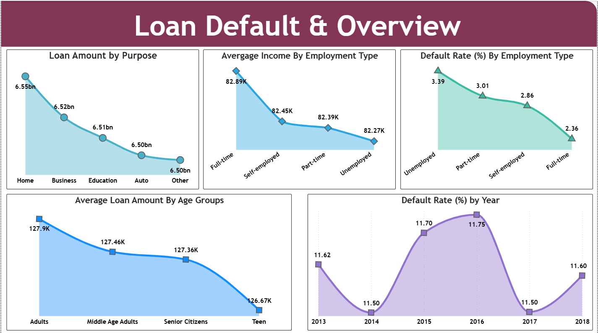
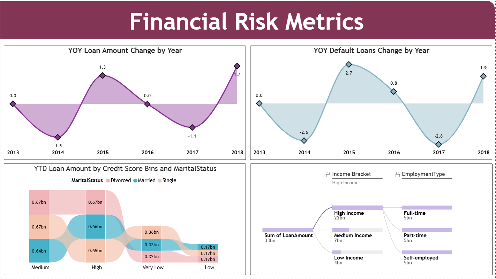

# 💳 Loan Default & Financial Risk Analysis – Power BI Dashboard

## 📊 Executive Overview

This Power BI dashboard analyzes loan portfolio data to identify default patterns, financial risk drivers, and borrower behavior trends. 

The objective of this project is to transform borrower-level financial data into actionable risk intelligence that supports credit assessment, portfolio monitoring, and strategic decision-making.

The solution integrates Microsoft SQL Server via Power BI Dataflows to ensure scalable and reliable financial reporting.

---

## 🎯 Business Objectives

- Identify key factors influencing loan default
- Analyze borrower financial profiles and credit risk exposure
- Monitor year-over-year default trends
- Enable data-driven lending and portfolio management decisions

---

## 📂 Dataset Overview

- Total Records: 255,347
- Total Columns: 19
- Time Range: ~6 Years
- No Missing Values

Key attributes include:
- Income
- Credit Score
- Loan Amount
- DTI Ratio
- Interest Rate
- Employment Type
- Loan Purpose
- Default Status

---

## 📊 Dashboard Structure

### 1️⃣ Loan Default & Overview

- Loan Amount by Purpose (Home, Business, Education, Auto, Other)
- Average Income by Employment Type
- Default Rate (%) by Employment Type
- Average Loan Amount by Age Group
- Year-wise Default Trend Analysis

**Key Insight:** Employment stability plays a stronger role in default probability than income alone.

---

### 2️⃣ Applicant Demographics & Financial Profile

- Loan Amount by Credit Score Segment
- Total Loans by Credit Score
- Loan Distribution by Mortgage & Dependents
- Loans by Education Level
- Average Loan Amount by Age & Marital Status

**Key Insight:** Medium and high credit score segments dominate loan exposure, but risk concentration varies by employment type.

---

### 3️⃣ Financial Risk Metrics

- Year-over-Year Loan Growth
- Year-over-Year Default Growth
- YTD Loan Amount by Credit Score & Marital Status
- Decomposition Tree Analysis (Income & Employment Type)

**Key Insight:** High-income borrowers hold majority of loan exposure, but default risk varies across employment categories.

---

## 💡 Strategic Business Insights

- Default rate remains relatively stable (~11–12%), indicating controlled portfolio risk.
- Employment type significantly impacts default probability.
- Income alone is not a sufficient predictor of risk.
- Portfolio exposure is concentrated within medium and high credit score segments.

---

## 🛠 Tech Stack

- Power BI
- DAX
- Microsoft SQL Server
- Power BI Dataflows
- Data Modeling

---

## 📷 Dashboard Screenshots

### Loan Default & Overview

### Applicant Demographics & Financial Profile

### Financial Risk Metrics

---

## 📌 Conclusion

This project demonstrates how financial loan data can be transformed into structured risk intelligence. By combining trend analysis, demographic profiling, and portfolio exposure monitoring, the dashboard enables proactive credit risk management and informed lending decisions.
